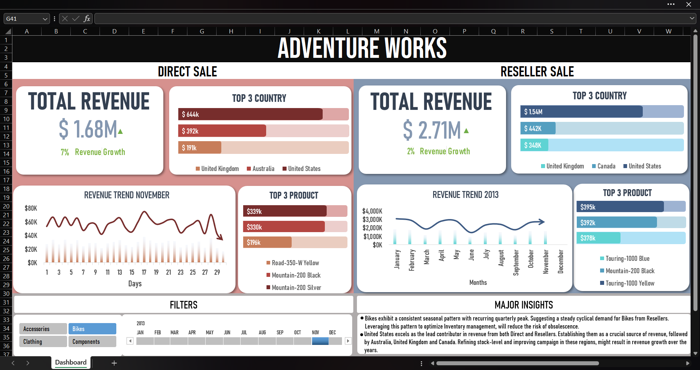
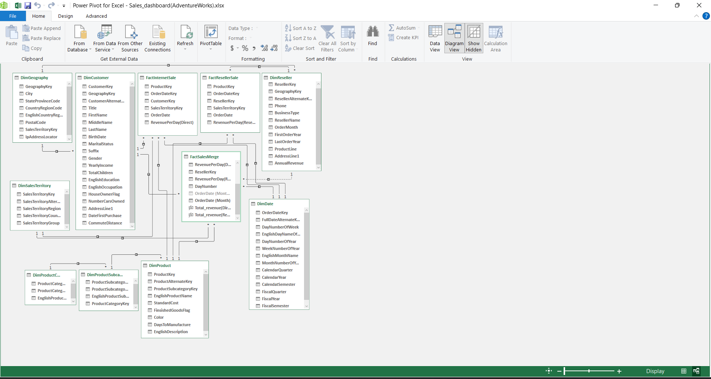

# 📈 Revenue Dashboard (Direct vs Reseller)

## 📌Project overview

- This project focuses on building a dynamic and user-interactive dashboard that answers ***key-business driven questions***.

- The dashboard helps stakeholders analyze Total revenue, Revenue growth month-over-month, Track revenue trends and identify growth opportunities through ***clear KPI's and visual insights***.

## 🗓️ Objective

- 📈 Identify ***revenue trend*** patterns and ***revenue growth*** month-over-month.

- 👥 Compare and analyze ***revenue trend*** between two ***channels (Direct and Reseller)***.

- 🗺️ Analyze and filter out best performing ***products and countries***.

## 📊 Project preview

## ⚒️ Tools used

#### 💻 Excel:
- ***Microsoft Excel*** (Power Query, Power Pivot, Data Model, Pivot Tables).

## 🛠️ Project workflow

 ### 📃 Dataset:
 - AdventureWorks is a public sample dataset provided by Microsoft. [AdventureWorks dataset](https://github.com/microsoft/sql-server-samples/tree/master/samples/databases/adventure-works/data-warehouse-install-script)

### 💉 Data ingestion:

 - Imported csv files using ***Get Data > From Folder*** option in Excel. [CSV files](Data_csv)

### 🧹 Data Cleaning:

 - ✅ Did ***data integrity*** check to eliminate ***duplicate values***, ***redundant columns*** and ***blank/duplicate rows*** in dimension tables.
 
 - ***Aggregated***, ***Grouped*** and ***combined*** Fact tables to better ***optimize*** the overall query performance.

### 🌠 Data model:

 - ⭐ Made a ***Data model*** utilizing ***Star constellation*** pattern in Power pivot, connecting Dimension tables and Fact tables using Primary and foreign keys.
 
 - 📄 The FactMerge table acts as ***the centre of constellation*** for ***better query performance*** and ***centralized timeline***.

## 💻 Pivot and aggregation:

 🎚️ **Slicer and Timeline**:
 -  Implemented slicer to filter between different ***ProductCategory***.
 -  Implemented Timeline to filter between ***month of the year***.
 -  Slicer and the Timeline are then ***connected to Pivot tables*** to influence data upon user's choice.

📊 **Data aggregation**:
 - Created measures ***"Total_revenue(Direct)"*** and ***"Total_revenue(Reseller)"*** using DAX function.
 - Made ***Pivot tables*** to derive the following answers from the data:
 1. ***Total revenue***, ***Top products***, ***Top Countries*** by Month and Product category.
 2. ***Revenue rate %*** = (Current revenue - Previous revenue) / Previous revenue.
 3. ***Revenue Trend*** by Month for Direct customers.
 4. ***Revenue Trend*** by Year for Resellers.

 📄 **Formatting and Visuals**:
- Built ***KPI's cards*** to show Total revenue by the month and product category and revenue rate%.
- Created ***Bar charts*** for Top products and Top countries.
- Created ***Line charts*** for Revenue trend month-over-month and Revenue trend year-over-year.

## 💹 Key insights
- 🚲 **Bikes** exhibit a ***consistent seasonal pattern*** with recurring ***quarterly peak***. Suggesting a steady cyclical demand for Bikes from Resellers. Leveraging this pattern to optimize ***Inventory management***, will reduce the risk of obsolescence.

- 🗺️ **United States** excels as the ***lead contributor*** in revenue from both Direct and Resellers. Establishing them as a crucial source of revenue, followed by Australia, United Kingdom and Canada. ***Refining stock-level*** and ***improving campaign*** in these regions, might result in revenue growth over the years.

- ***Mountain bikes*** generate the ***highest revenue*** from direct customers. In contrast, the reseller's side is much more ***sparse and balanced*** across categories. Utilizing this information to better adapt ***inventory management*** can reduce the risk of ***obsolescence***.